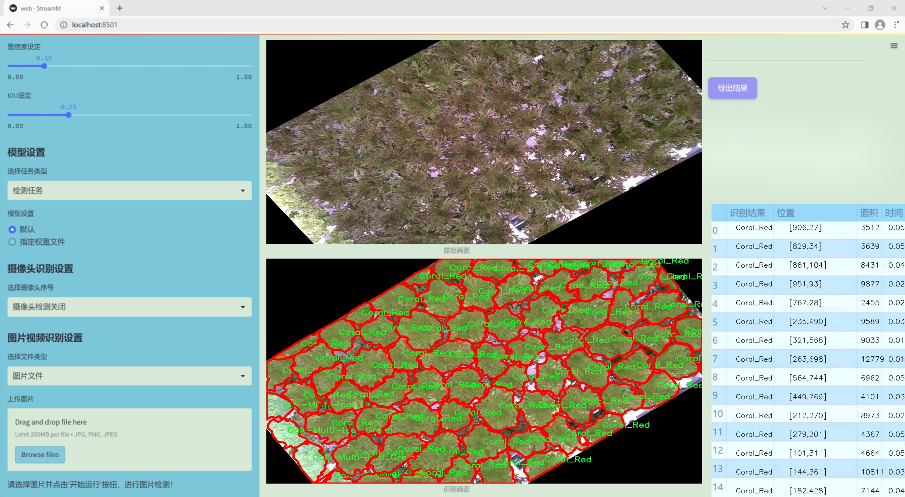
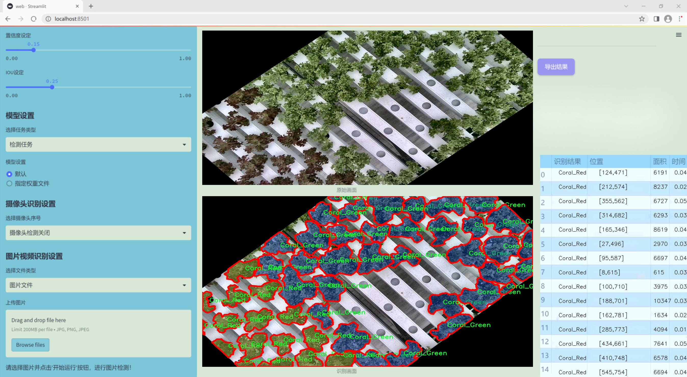
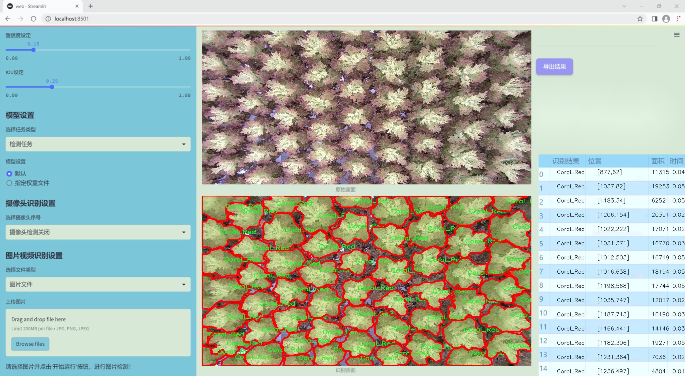
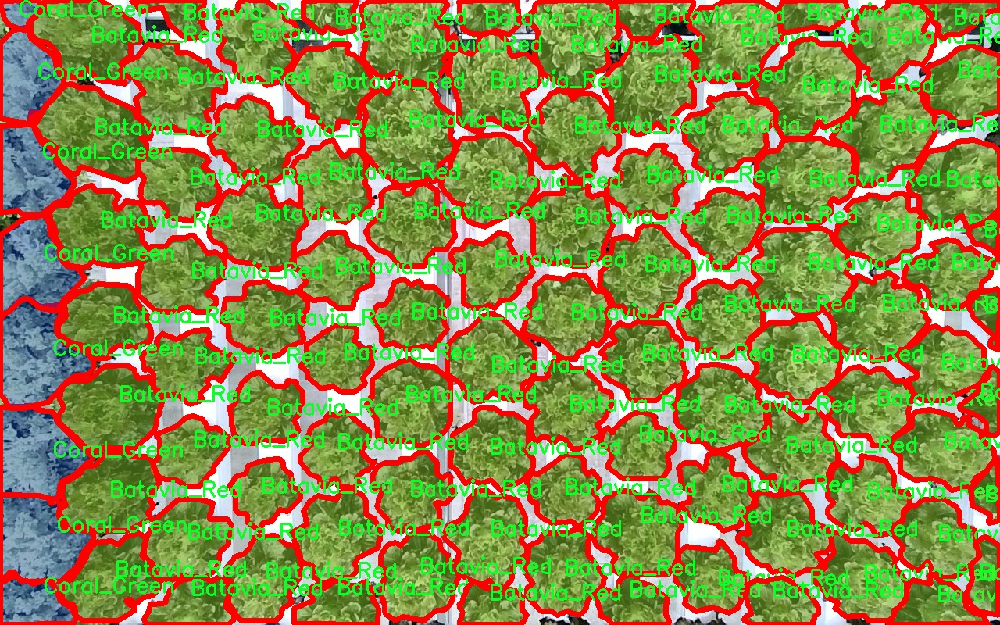
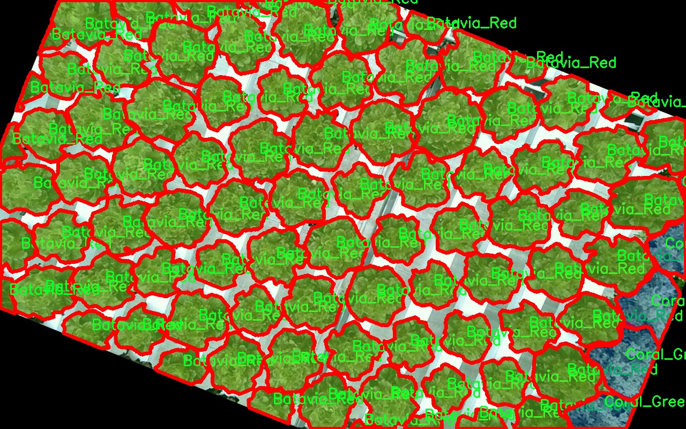
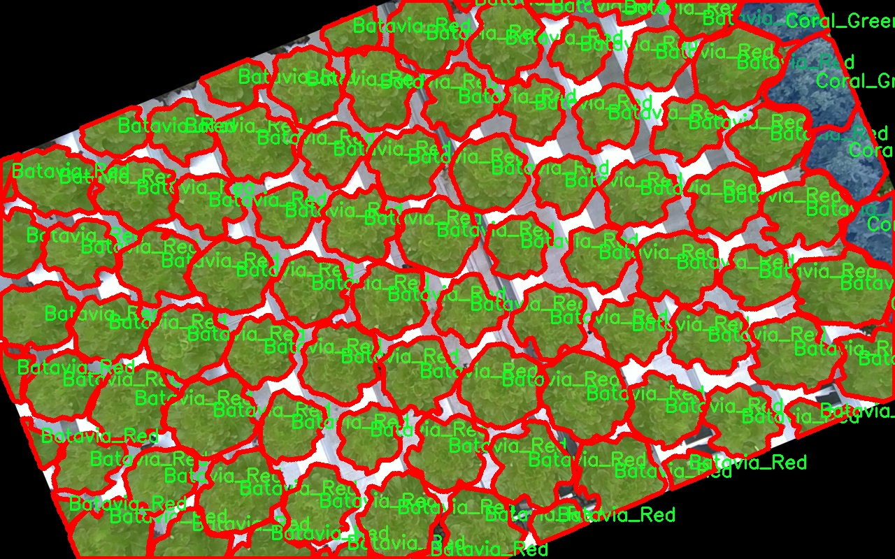
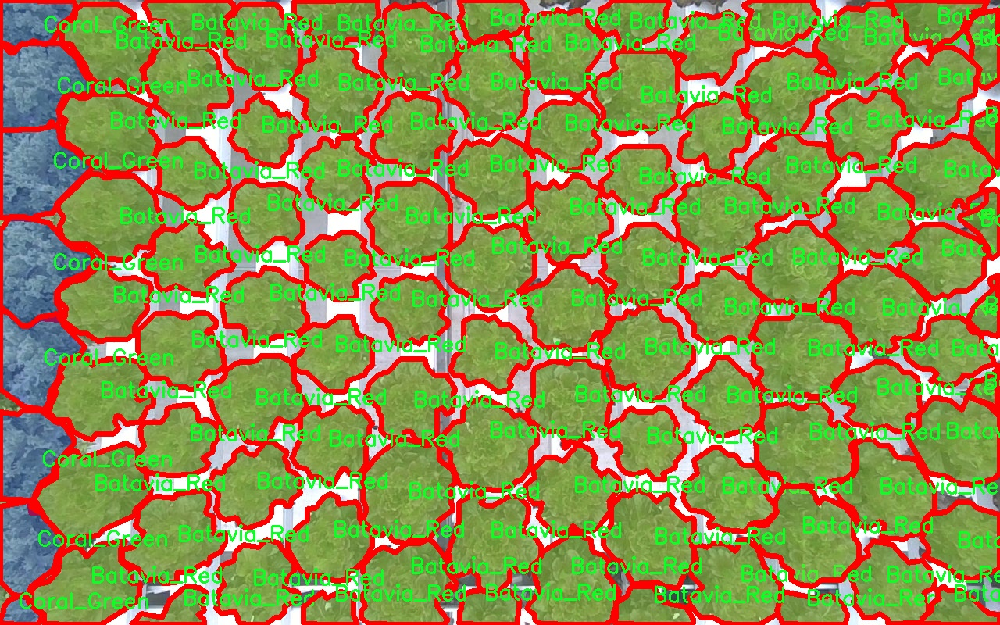
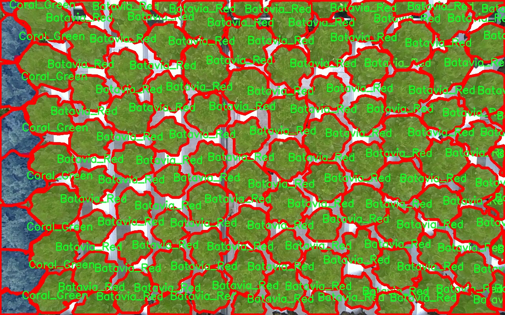

### 1.背景意义

研究背景与意义

随着全球气候变化和生态环境的不断恶化，植物的保护与管理变得愈发重要。植物叶片作为植物生长和光合作用的主要器官，其健康状况直接影响到植物的生长和产量。因此，开发高效的植物叶片分类系统，不仅能够帮助农民及时识别植物健康状况，还能为农业生产提供科学依据。近年来，深度学习技术在计算机视觉领域取得了显著进展，尤其是目标检测和图像分类任务中，基于卷积神经网络（CNN）的模型如YOLO（You Only Look Once）系列，因其高效性和准确性，逐渐成为植物叶片分类的研究热点。

本研究旨在基于改进的YOLOv11模型，构建一个高效的植物叶片分类系统。该系统将利用一个包含4900张图像的多类别数据集，涵盖了七种不同类型的植物叶片，包括Batavia_Green、Batavia_Red、Coral_Green、Coral_Red、Crystal_Green、Oak-Multi-leaf_Green和incised-leaf_Red。这些类别的选择不仅具有代表性，还反映了不同植物在生态系统中的多样性。通过对这些叶片图像的分析和分类，可以为植物病害的早期检测和防治提供重要支持。

此外，改进YOLOv11模型的引入，旨在提升分类的准确性和实时性。YOLO系列模型以其端到端的特性，能够在保持高精度的同时，实现快速的推理速度，适合在农业生产的实际应用中进行实时监测。通过本研究的实施，期望能够为植物保护、生态监测以及智能农业的发展提供新的思路和技术支持，从而推动可持续农业的进步。

### 2.视频效果

[2.1 视频效果](https://www.bilibili.com/video/BV1MJkQYgExX/)

### 3.图片效果







##### [项目涉及的源码数据来源链接](https://kdocs.cn/l/cszuIiCKVNis)**

注意：本项目提供训练的数据集和训练教程,由于版本持续更新,暂不提供权重文件（best.pt）,请按照6.训练教程进行训练后实现上图演示的效果。

### 4.数据集信息

##### 4.1 本项目数据集类别数＆类别名

nc: 7
names: ['Batavia_Green', 'Batavia_Red', 'Coral_Green', 'Coral_Red', 'Crystal_Green', 'Oak-Multi-leaf_Green', 'incised-leaf_Red']


该项目为【图像分割】数据集，请在【训练教程和Web端加载模型教程（第三步）】这一步的时候按照【图像分割】部分的教程来训练

##### 4.2 本项目数据集信息介绍

本项目数据集信息介绍

本项目所使用的数据集专注于植物叶片的分类，旨在通过改进YOLOv11模型来提升植物叶片识别的准确性和效率。该数据集的主题为“tkdcnfmfsksnwk0823”，其设计初衷是为了解决植物叶片分类中存在的多样性和复杂性问题。数据集中包含七个不同的类别，分别为Batavia_Green、Batavia_Red、Coral_Green、Coral_Red、Crystal_Green、Oak-Multi-leaf_Green以及incised-leaf_Red。这些类别涵盖了多种植物叶片的颜色和形态特征，提供了丰富的样本，以便于模型在训练过程中能够学习到不同植物叶片的独特特征。

每个类别的样本均经过精心挑选和标注，确保数据的准确性和代表性。Batavia_Green和Batavia_Red分别代表了不同色彩的Batavia品种，展现了同一植物在不同生长条件下的色彩变化；而Coral_Green和Coral_Red则展示了Coral品种的多样性。Crystal_Green则以其独特的晶莹剔透的叶片特征吸引了研究者的注意。Oak-Multi-leaf_Green则包含了多片叶子的样本，适合用于分析植物的生长模式和生态适应性。最后，incised-leaf_Red类别则代表了叶片边缘有明显缺口的植物，提供了对植物形态多样性的进一步理解。

通过对这些类别的深入分析和研究，本项目希望能够构建一个高效的植物叶片分类系统，进而推动植物科学研究和农业生产的智能化发展。数据集的多样性和丰富性为模型的训练提供了坚实的基础，使得改进后的YOLOv11能够在实际应用中表现出更高的准确率和鲁棒性。











### 5.全套项目环境部署视频教程（零基础手把手教学）

[5.1 所需软件PyCharm和Anaconda安装教程（第一步）](https://www.bilibili.com/video/BV1BoC1YCEKi/?spm_id_from=333.999.0.0&vd_source=bc9aec86d164b67a7004b996143742dc)


[5.2 安装Python虚拟环境创建和依赖库安装视频教程（第二步）](https://www.bilibili.com/video/BV1ZoC1YCEBw?spm_id_from=333.788.videopod.sections&vd_source=bc9aec86d164b67a7004b996143742dc)

### 6.改进YOLOv11训练教程和Web_UI前端加载模型教程（零基础手把手教学）

[6.1 改进YOLOv11训练教程和Web_UI前端加载模型教程（第三步）](https://www.bilibili.com/video/BV1BoC1YCEhR?spm_id_from=333.788.videopod.sections&vd_source=bc9aec86d164b67a7004b996143742dc)


按照上面的训练视频教程链接加载项目提供的数据集，运行train.py即可开始训练



     Epoch   gpu_mem       box       obj       cls    labels  img_size
     1/200     20.8G   0.01576   0.01955  0.007536        22      1280: 100%|██████████| 849/849 [14:42<00:00,  1.04s/it]
               Class     Images     Labels          P          R     mAP@.5 mAP@.5:.95: 100%|██████████| 213/213 [01:14<00:00,  2.87it/s]
                 all       3395      17314      0.994      0.957      0.0957      0.0843

     Epoch   gpu_mem       box       obj       cls    labels  img_size
     2/200     20.8G   0.01578   0.01923  0.007006        22      1280: 100%|██████████| 849/849 [14:44<00:00,  1.04s/it]
               Class     Images     Labels          P          R     mAP@.5 mAP@.5:.95: 100%|██████████| 213/213 [01:12<00:00,  2.95it/s]
                 all       3395      17314      0.996      0.956      0.0957      0.0845

     Epoch   gpu_mem       box       obj       cls    labels  img_size
     3/200     20.8G   0.01561    0.0191  0.006895        27      1280: 100%|██████████| 849/849 [10:56<00:00,  1.29it/s]
               Class     Images     Labels          P          R     mAP@.5 mAP@.5:.95: 100%|███████   | 187/213 [00:52<00:00,  4.04it/s]
                 all       3395      17314      0.996      0.957      0.0957      0.0845


###### [项目数据集下载链接](https://kdocs.cn/l/cszuIiCKVNis)

### 7.原始YOLOv11算法讲解

YOLOv11是一种由Ultralytics公司开发的最新一代目标检测模型，以其增强的特征提取能力和更高的效率在计算机视觉领域引人注目。该模型在架构上进行了关键升级，通过更新主干和颈部结构，显著提高了对复杂视觉场景的理解和处理精度。YOLOv11不仅在目标检测上表现出色，还支持实例分割、图像分类、姿态估计和定向目标检测（OBB）等任务，展示出其多功能性。

与其前身YOLOv8相比，YOLOv11在设计上实现了深度和宽度的改变，同时引入了几个创新机制。其中，C3k2机制是对YOLOv8中的C2f的改进，提升了浅层特征的处理能力；C2PSA机制则进一步优化了特征图的处理流程。解耦头的创新设计，通过增加两个深度卷积（DWConv），提高了模型对细节的感知能力和分类准确性。

在性能上，YOLOv11m模型在COCO数据集上的平均精度（mAP）提高，并减少了22%的参数量，确保了在运算效率上的突破。该模型可以部署在多种平台上，包括边缘设备、云平台以及支持NVIDIA GPU的系统，彰显出卓越的灵活性和适应性。总体而言，YOLOv11通过一系列的创新突破，对目标检测领域产生了深远的影响，并为未来的开发提供了新的研究方向。


****文档**** ： _ _https://docs.ultralytics.com/models/yolo11/__

****代码链接**** ： _ _https://github.com/ultralytics/ultralytics__

******Performance Metrics******


​ ** **关键特性****

****◆**** ** **增强的特征提取能力**** ：YOLO11采用了改进的主干和颈部架构，增强了 ** **特征提取****
能力，能够实现更精确的目标检测和复杂任务的执行。

****◆**** ** **优化的效率和速度****
：YOLO11引入了精细化的架构设计和优化的训练流程，提供更快的处理速度，并在准确性和性能之间保持最佳平衡。

****◆**** ** **参数更少、精度更高****
：通过模型设计的改进，YOLO11m在COCO数据集上实现了更高的平均精度（mAP），同时使用的参数比YOLOv8m少22%，使其在计算上更加高效，而不牺牲准确性。

****◆**** ** **跨环境的适应性**** ：YOLO11可以无缝部署在各种环境中，包括边缘设备、云平台和支持NVIDIA
GPU的系统，确保最大的灵活性。

****◆**** ** **支持广泛任务****
：无论是目标检测、实例分割、图像分类、姿态估计还是定向目标检测（OBB），YOLO11都旨在应对一系列计算机视觉挑战。

****支持的任务和模式****


​YOLO11建立在YOLOv8中引入的多功能模型范围之上，为各种计算机视觉任务提供增强的支持:


​该表提供了YOLO11模型变体的概述，展示了它们在特定任务中的适用性以及与Inference、Validation、Training和Export等操作模式的兼容性。从实时检测到复杂的分割任务
，这种灵活性使YOLO11适用于计算机视觉的广泛应用。

##### yolov11的创新

■ yolov8 VS yolov11

YOLOv5，YOLOv8和YOLOv11均是ultralytics公司的作品，ultralytics出品必属精品。


​ **具体创新点** ：

**① 深度（depth）和宽度 （width）**

YOLOv8和YOLOv11是基本上完全不同。

**② C3k2机制**

C3k2有参数为c3k，其中在网络的浅层c3k设置为False。C3k2就相当于YOLOv8中的C2f。


​ **③ C2PSA机制**

下图为C2PSA机制的原理图。


​ **④ 解耦头**

解耦头中的分类检测头增加了两个 **DWConv** 。


▲Conv

    
    
    def autopad(k, p=None, d=1):  # kernel, padding, dilation
    
        """Pad to 'same' shape outputs."""
    
        if d > 1:
    
            k = d * (k - 1) + 1 if isinstance(k, int) else [d * (x - 1) + 1 for x in k]  # actual kernel-size
    
        if p is None:
    
            p = k // 2 if isinstance(k, int) else [x // 2 for x in k]  # auto-pad
    
    return p
    
    
    class Conv(nn.Module):
    
        """Standard convolution with args(ch_in, ch_out, kernel, stride, padding, groups, dilation, activation)."""
    
    
        default_act = nn.SiLU()  # default activation
    
    
        def __init__(self, c1, c2, k=1, s=1, p=None, g=1, d=1, act=True):
    
            """Initialize Conv layer with given arguments including activation."""
    
            super().__init__()
    
            self.conv = nn.Conv2d(c1, c2, k, s, autopad(k, p, d), groups=g, dilation=d, bias=False)
    
            self.bn = nn.BatchNorm2d(c2)
    
            self.act = self.default_act if act is True else act if isinstance(act, nn.Module) else nn.Identity()
    
    
        def forward(self, x):
    
            """Apply convolution, batch normalization and activation to input tensor."""
    
            return self.act(self.bn(self.conv(x)))
    
    
        def forward_fuse(self, x):
    
            """Perform transposed convolution of 2D data."""
    
            return self.act(self.conv(x))

▲Conv2d

    
    
    torch.nn.Conv2d(in_channels, out_channels, kernel_size, stride=1, padding=0, dilation=1, groups=1, bias=True, padding_mode='zeros')

▲DWConv

DWConv ** **代表 Depthwise Convolution（深度卷积）****
，是一种在卷积神经网络中常用的高效卷积操作。它主要用于减少计算复杂度和参数量。

    
    
    class DWConv(Conv):
    
        """Depth-wise convolution."""
    
    
        def __init__(self, c1, c2, k=1, s=1, d=1, act=True):  # ch_in, ch_out, kernel, stride, dilation, activation
    
            """Initialize Depth-wise convolution with given parameters."""
    
            super().__init__(c1, c2, k, s, g=math.gcd(c1, c2), d=d, act=act)


### 8.200+种全套改进YOLOV11创新点原理讲解

#### 8.1 200+种全套改进YOLOV11创新点原理讲解大全

由于篇幅限制，每个创新点的具体原理讲解就不全部展开，具体见下列网址中的改进模块对应项目的技术原理博客网址【Blog】（创新点均为模块化搭建，原理适配YOLOv5~YOLOv11等各种版本）

[改进模块技术原理博客【Blog】网址链接](https://gitee.com/qunmasj/good)


#### 8.2 精选部分改进YOLOV11创新点原理讲解

###### 这里节选部分改进创新点展开原理讲解(完整的改进原理见上图和[改进模块技术原理博客链接](https://gitee.com/qunmasj/good)【如果此小节的图加载失败可以通过CSDN或者Github搜索该博客的标题访问原始博客，原始博客图片显示正常】


### FocalModulation模型的基本原理
参考该博客，Focal Modulation Networks（FocalNets）的基本原理是替换自注意力（Self-Attention）模块，使用焦点调制（focal modulation）机制来捕捉图像中的长距离依赖和上下文信息。下图是自注意力和焦点调制两种方法的对比。


自注意力要求对每个查询令牌（Query Token）与其他令牌进行复杂的查询-键（Query-Key）交互和查询-值（Query-Value）聚合，以计算注意力分数并捕捉上下文。而焦点调制则先将空间上下文以不同粒度聚合到调制器中，然后以查询依赖的方式将这些调制器注入到查询令牌中。焦点调制简化了交互和聚合操作，使其更轻量级。在图中，自注意力部分使用红色虚线表示查询-键交互和黄色虚线表示查询-值聚合，而焦点调制部分则用蓝色表示调制器聚合和黄色表示查询-调制器交互。 

FocalModulation模型通过以下步骤实现：

1. 焦点上下文化：用深度卷积层堆叠来编码不同范围的视觉上下文。


2. 门控聚合：通过门控机制，选择性地将上下文信息聚合到每个查询令牌的调制器中。


3. 逐元素仿射变换：将聚合后的调制器通过仿射变换注入到每个查询令牌中。

下面来分别介绍这三个机制->

#### 焦点上下文化
焦点上下文化（Focal Contextualization）是焦点调制（Focal Modulation）的一个组成部分。焦点上下文化使用一系列深度卷积层（depth-wise convolutional layers）来编码不同范围内的视觉上下文信息。这些层可以捕捉从近处到远处的视觉特征，从而允许网络在不同层次上理解图像内容。通过这种方式，网络能够在聚合上下文信息时保持对局部细节的敏感性，并增强对全局结构的认识。


​

这张图详细比较了自注意力（Self-Attention, SA）和焦点调制（Focal Modulation）的机制，并特别展示了焦点调制中的上下文聚合过程。左侧的图展示了自注意力模型如何通过键（k）和查询（q）之间的交互，以及随后的聚合来生成输出。而中间和右侧的图说明了焦点调制如何通过层级化的上下文聚合和门控聚合过程替代自注意力模型的这一过程。在焦点调制中，输入首先通过轻量级线性层进行处理，然后通过层级化的上下文化模块和门控机制来选择性地聚合信息，最终通过调制器与查询（q）进行交互以生成输出。

#### 门控聚合
在Focal Modulation Networks（FocalNets）中的 "门控聚合"（Gated Aggregation）是关键组件之一，这一过程涉及使用门控机制来选择性地聚合上下文信息。以下是这个过程的详细分析：

1. 什么是门控机制？
门控机制在深度学习中常用于控制信息流。它通常用于决定哪些信息应该被传递，哪些应该被阻断。在循环神经网络（RNN）中，特别是在长短期记忆网络（LSTM）和门控循环单元（GRU）中，门控机制用于调节信息在时间序列数据中的流动。

2. 门控聚合的目的
在FocalNets中，门控聚合的目的是为每个查询令牌（即处理中的数据单元）选择性地聚合上下文信息。这意味着网络能够决定哪些特定的上下文信息对于当前处理的查询令牌是重要的，从而专注于那些最相关的信息。

3. 如何实现门控聚合？
实现门控聚合可能涉及一系列计算步骤，其中包括：

计算上下文信息：这可能涉及使用深度卷积层（如文中提到的）对输入图像的不同区域进行编码，以捕捉从局部到全局的视觉上下文。
门控操作：这一步骤涉及到一个决策过程，根据当前查询令牌的特征来决定哪些上下文信息是相关的。这可能通过一个学习到的权重（门）来实现，该权重决定了不同上下文信息的重要性。
信息聚合：最后，根据门控操作的结果，选择性地聚合上下文信息到一个调制器中。这个调制器随后被用于调整或“调制”查询令牌的表示。
4. 门控聚合的好处
通过门控聚合，FocalNets能够更有效地聚焦于对当前任务最关键的信息。这种方法提高了模型的效率和性能，因为它减少了不必要信息的处理，同时增强了对关键特征的关注。在视觉任务中，这可能意味着更好的目标检测和图像分类性能，特别是在复杂或多变的视觉环境中。

总结：门控聚合是FocalNets的一个核心组成部分，它通过选择性地集中处理重要的上下文信息来提升网络的效率和性能。

#### 逐元素仿射变换
在Focal Modulation Networks（FocalNets）中的第三个关键组件是逐元素仿射变换，这个步骤涉及将通过门控聚合得到的调制器注入到每个查询令牌中。以下是该过程的详细分析：

1. 仿射变换的基本概念：
仿射变换是一种线性变换，用于对数据进行缩放、旋转、平移和倾斜等操作。在深度学习中，逐元素的仿射变换通常指的是对每个元素进行线性变换，这种变换可以被描述为y = ax + b，其中x是输入，y是输出，a和b是变换的参数。

2. 逐元素仿射变换的作用：
在FocalNets中，逐元素仿射变换的作用是将聚合后的调制器信息注入到每个查询令牌中。这个步骤对于整合上下文信息和查询令牌的原始特征非常重要。通过这种方式，调制器所包含的上下文信息可以直接影响查询令牌的表示。

3. 执行仿射变换：
执行这一步骤时，聚合后的调制器对每个查询令牌进行逐元素的仿射变换。在实践中，这可能意味着对查询令牌的每个特征应用调制器中的相应权重（a）和偏差（b）。这样，调制器中的每个元素都直接对应于查询令牌的一个特征，通过调整这些特征来改变其表达。

4. 仿射变换的效果：
通过逐元素仿射变换，模型能够更细致地调整每个查询令牌的特征，根据上下文信息来增强或抑制某些特征。这种精细的调整机制允许网络更好地适应复杂的视觉场景，提高对细节的捕捉能力，从而提升了模型在各种视觉任务中的性能，如目标检测和图像分类。

总结：逐元素仿射变换它使得模型能够利用上下文信息来有效地调整查询令牌，增强了模型对关键视觉特征的捕捉和表达能力。


### 9.系统功能展示

图9.1.系统支持检测结果表格显示

  图9.2.系统支持置信度和IOU阈值手动调节

  图9.3.系统支持自定义加载权重文件best.pt(需要你通过步骤5中训练获得)

  图9.4.系统支持摄像头实时识别

  图9.5.系统支持图片识别

  图9.6.系统支持视频识别

  图9.7.系统支持识别结果文件自动保存

  图9.8.系统支持Excel导出检测结果数据


### 10. YOLOv11核心改进源码讲解

#### 10.1 wtconv2d.py

以下是对代码的核心部分进行分析和详细注释的结果：

```python
import torch
import torch.nn as nn
import torch.nn.functional as F
from torch.autograd import Function
import pywt

# 创建小波滤波器
def create_wavelet_filter(wave, in_size, out_size, type=torch.float):
    # 使用pywt库创建小波对象
    w = pywt.Wavelet(wave)
    
    # 获取小波的分解滤波器
    dec_hi = torch.tensor(w.dec_hi[::-1], dtype=type)  # 高频滤波器
    dec_lo = torch.tensor(w.dec_lo[::-1], dtype=type)  # 低频滤波器
    
    # 组合成分解滤波器
    dec_filters = torch.stack([
        dec_lo.unsqueeze(0) * dec_lo.unsqueeze(1),
        dec_lo.unsqueeze(0) * dec_hi.unsqueeze(1),
        dec_hi.unsqueeze(0) * dec_lo.unsqueeze(1),
        dec_hi.unsqueeze(0) * dec_hi.unsqueeze(1)
    ], dim=0)

    # 重复滤波器以适应输入通道数
    dec_filters = dec_filters[:, None].repeat(in_size, 1, 1, 1)

    # 获取小波的重构滤波器
    rec_hi = torch.tensor(w.rec_hi[::-1], dtype=type).flip(dims=[0])
    rec_lo = torch.tensor(w.rec_lo[::-1], dtype=type).flip(dims=[0])
    
    # 组合成重构滤波器
    rec_filters = torch.stack([
        rec_lo.unsqueeze(0) * rec_lo.unsqueeze(1),
        rec_lo.unsqueeze(0) * rec_hi.unsqueeze(1),
        rec_hi.unsqueeze(0) * rec_lo.unsqueeze(1),
        rec_hi.unsqueeze(0) * rec_hi.unsqueeze(1)
    ], dim=0)

    # 重复滤波器以适应输出通道数
    rec_filters = rec_filters[:, None].repeat(out_size, 1, 1, 1)

    return dec_filters, rec_filters

# 小波变换
def wavelet_transform(x, filters):
    b, c, h, w = x.shape  # 获取输入的形状
    pad = (filters.shape[2] // 2 - 1, filters.shape[3] // 2 - 1)  # 计算填充
    # 进行卷积操作
    x = F.conv2d(x, filters.to(x.dtype).to(x.device), stride=2, groups=c, padding=pad)
    x = x.reshape(b, c, 4, h // 2, w // 2)  # 重塑输出形状
    return x

# 逆小波变换
def inverse_wavelet_transform(x, filters):
    b, c, _, h_half, w_half = x.shape  # 获取输入的形状
    pad = (filters.shape[2] // 2 - 1, filters.shape[3] // 2 - 1)  # 计算填充
    x = x.reshape(b, c * 4, h_half, w_half)  # 重塑输入形状
    # 进行转置卷积操作
    x = F.conv_transpose2d(x, filters.to(x.dtype).to(x.device), stride=2, groups=c, padding=pad)
    return x

# 定义小波变换的函数
class WaveletTransform(Function):
    @staticmethod
    def forward(ctx, input, filters):
        ctx.filters = filters  # 保存滤波器
        with torch.no_grad():
            x = wavelet_transform(input, filters)  # 执行小波变换
        return x

    @staticmethod
    def backward(ctx, grad_output):
        grad = inverse_wavelet_transform(grad_output, ctx.filters)  # 计算梯度
        return grad, None

# 定义逆小波变换的函数
class InverseWaveletTransform(Function):
    @staticmethod
    def forward(ctx, input, filters):
        ctx.filters = filters  # 保存滤波器
        with torch.no_grad():
            x = inverse_wavelet_transform(input, filters)  # 执行逆小波变换
        return x

    @staticmethod
    def backward(ctx, grad_output):
        grad = wavelet_transform(grad_output, ctx.filters)  # 计算梯度
        return grad, None

# 定义小波卷积层
class WTConv2d(nn.Module):
    def __init__(self, in_channels, out_channels, kernel_size=5, stride=1, bias=True, wt_levels=1, wt_type='db1'):
        super(WTConv2d, self).__init__()

        assert in_channels == out_channels  # 输入通道数必须等于输出通道数

        self.in_channels = in_channels
        self.wt_levels = wt_levels
        self.stride = stride

        # 创建小波滤波器
        self.wt_filter, self.iwt_filter = create_wavelet_filter(wt_type, in_channels, in_channels, torch.float)
        self.wt_filter = nn.Parameter(self.wt_filter, requires_grad=False)  # 小波滤波器
        self.iwt_filter = nn.Parameter(self.iwt_filter, requires_grad=False)  # 逆小波滤波器
        
        # 初始化小波变换和逆小波变换的函数
        self.wt_function = wavelet_transform_init(self.wt_filter)
        self.iwt_function = inverse_wavelet_transform_init(self.iwt_filter)

        # 基础卷积层
        self.base_conv = nn.Conv2d(in_channels, in_channels, kernel_size, padding='same', stride=1, groups=in_channels, bias=bias)
        self.base_scale = _ScaleModule([1, in_channels, 1, 1])  # 缩放模块

        # 小波卷积层
        self.wavelet_convs = nn.ModuleList(
            [nn.Conv2d(in_channels * 4, in_channels * 4, kernel_size, padding='same', stride=1, groups=in_channels * 4, bias=False) for _ in range(self.wt_levels)]
        )
        self.wavelet_scale = nn.ModuleList(
            [_ScaleModule([1, in_channels * 4, 1, 1], init_scale=0.1) for _ in range(self.wt_levels)]
        )

        # 如果步幅大于1，定义步幅卷积
        if self.stride > 1:
            self.stride_filter = nn.Parameter(torch.ones(in_channels, 1, 1, 1), requires_grad=False)
            self.do_stride = lambda x_in: F.conv2d(x_in, self.stride_filter.to(x_in.dtype).to(x_in.device), bias=None, stride=self.stride, groups=in_channels)
        else:
            self.do_stride = None

    def forward(self, x):
        # 前向传播过程
        x_ll_in_levels = []  # 存储低频分量
        x_h_in_levels = []   # 存储高频分量
        shapes_in_levels = [] # 存储形状信息

        curr_x_ll = x  # 当前低频分量

        # 小波变换过程
        for i in range(self.wt_levels):
            curr_shape = curr_x_ll.shape
            shapes_in_levels.append(curr_shape)  # 记录当前形状
            if (curr_shape[2] % 2 > 0) or (curr_shape[3] % 2 > 0):
                curr_pads = (0, curr_shape[3] % 2, 0, curr_shape[2] % 2)  # 计算填充
                curr_x_ll = F.pad(curr_x_ll, curr_pads)  # 填充

            curr_x = self.wt_function(curr_x_ll)  # 小波变换
            curr_x_ll = curr_x[:, :, 0, :, :]  # 取低频分量
            
            shape_x = curr_x.shape
            curr_x_tag = curr_x.reshape(shape_x[0], shape_x[1] * 4, shape_x[3], shape_x[4])  # 重塑
            curr_x_tag = self.wavelet_scale[i](self.wavelet_convs[i](curr_x_tag))  # 小波卷积和缩放
            curr_x_tag = curr_x_tag.reshape(shape_x)  # 重塑回原形状

            x_ll_in_levels.append(curr_x_tag[:, :, 0, :, :])  # 存储低频分量
            x_h_in_levels.append(curr_x_tag[:, :, 1:4, :, :])  # 存储高频分量

        next_x_ll = 0  # 初始化下一个低频分量

        # 逆小波变换过程
        for i in range(self.wt_levels - 1, -1, -1):
            curr_x_ll = x_ll_in_levels.pop()  # 取出低频分量
            curr_x_h = x_h_in_levels.pop()  # 取出高频分量
            curr_shape = shapes_in_levels.pop()  # 取出形状信息

            curr_x_ll = curr_x_ll + next_x_ll  # 合并低频分量

            curr_x = torch.cat([curr_x_ll.unsqueeze(2), curr_x_h], dim=2)  # 合并低频和高频分量
            next_x_ll = self.iwt_function(curr_x)  # 逆小波变换

            next_x_ll = next_x_ll[:, :, :curr_shape[2], :curr_shape[3]]  # 裁剪到原始形状

        x_tag = next_x_ll  # 最终输出的低频分量
        assert len(x_ll_in_levels) == 0  # 确保所有低频分量都已处理
        
        x = self.base_scale(self.base_conv(x))  # 基础卷积和缩放
        x = x + x_tag  # 合并结果
        
        if self.do_stride is not None:
            x = self.do_stride(x)  # 应用步幅卷积

        return x

# 定义缩放模块
class _ScaleModule(nn.Module):
    def __init__(self, dims, init_scale=1.0, init_bias=0):
        super(_ScaleModule, self).__init__()
        self.dims = dims
        self.weight = nn.Parameter(torch.ones(*dims) * init_scale)  # 初始化权重
        self.bias = None  # 暂不使用偏置
    
    def forward(self, x):
        return torch.mul(self.weight, x)  # 进行缩放操作
```

### 代码分析
1. **小波滤波器创建**：`create_wavelet_filter` 函数使用 PyWavelets 库创建小波滤波器，用于小波变换和逆变换。
2. **小波变换和逆变换**：`wavelet_transform` 和 `inverse_wavelet_transform` 函数实现了小波变换和逆变换的具体操作，利用卷积和转置卷积实现。
3. **自定义的函数**：`WaveletTransform` 和 `InverseWaveletTransform` 类实现了小波变换和逆变换的自动求导功能，允许在训练过程中使用。
4. **小波卷积层**：`WTConv2d` 类是一个自定义的卷积层，结合了小波变换和卷积操作，支持多层小波变换和逆变换。
5. **缩放模块**：`_ScaleModule` 类用于对输入进行缩放操作，便于调整输出的幅度。

整体而言，该代码实现了一个结合小波变换的卷积神经网络模块，适用于处理具有多层次特征的图像数据。

这个程序文件`wtconv2d.py`实现了一个基于小波变换的二维卷积层，主要用于图像处理和特征提取。文件中使用了PyTorch库，结合了小波变换的概念，以便在卷积操作中引入多尺度特征。

首先，文件导入了必要的库，包括PyTorch的核心模块和功能模块，以及用于小波变换的`pywt`库。接着，定义了一个函数`create_wavelet_filter`，该函数用于创建小波变换的滤波器。它接受小波类型、输入通道数和输出通道数作为参数，生成对应的小波滤波器和重构滤波器。这些滤波器通过小波的分解和重构系数生成，并进行了适当的维度调整。

接下来，定义了两个函数`wavelet_transform`和`inverse_wavelet_transform`，分别用于执行小波变换和逆小波变换。小波变换通过对输入张量进行卷积操作来实现，输出的张量被重塑为适合多尺度表示的形状。逆小波变换则是将多尺度的表示重新组合为原始的输入形状。

在小波变换和逆变换的过程中，使用了`WaveletTransform`和`InverseWaveletTransform`两个类，这两个类继承自`torch.autograd.Function`，分别实现了前向和反向传播的功能。它们在前向传播中调用之前定义的小波变换和逆变换函数，而在反向传播中则计算梯度。

随后，定义了`WTConv2d`类，这是整个文件的核心部分，继承自`nn.Module`。在构造函数中，初始化了输入和输出通道数、小波变换的层数、步幅等参数，并创建了小波滤波器和逆滤波器。该类还包含了基础卷积层和多个小波卷积层的定义。小波卷积层通过多个卷积操作提取多尺度特征，并在每个层次上应用缩放模块。

在`forward`方法中，首先进行小波变换，将输入信号分解为低频和高频部分。然后，经过多个小波卷积层处理后，再进行逆小波变换，将特征重构为输出信号。最后，如果设置了步幅，则通过额外的卷积操作调整输出的空间维度。

最后，定义了一个私有类`_ScaleModule`，用于对输入进行缩放操作。这个模块在卷积层中用于调整特征的尺度，以便更好地适应后续的处理。

总的来说，这个文件实现了一个结合小波变换的卷积层，能够在多尺度上提取特征，适用于图像处理和深度学习任务。通过小波变换，可以有效地捕捉图像中的细节和结构信息，从而提高模型的表现。

#### 10.2 activation.py

```python
import torch
import torch.nn as nn

class AGLU(nn.Module):
    """统一激活函数模块，来源于 https://github.com/kostas1515/AGLU。"""

    def __init__(self, device=None, dtype=None) -> None:
        """初始化统一激活函数模块。"""
        super().__init__()
        # 使用Softplus作为激活函数的一部分，beta设置为-1.0
        self.act = nn.Softplus(beta=-1.0)
        # 初始化lambda参数，使用均匀分布
        self.lambd = nn.Parameter(nn.init.uniform_(torch.empty(1, device=device, dtype=dtype)))  
        # 初始化kappa参数，使用均匀分布
        self.kappa = nn.Parameter(nn.init.uniform_(torch.empty(1, device=device, dtype=dtype)))  

    def forward(self, x: torch.Tensor) -> torch.Tensor:
        """计算统一激活函数的前向传播。"""
        # 将lambda参数限制在最小值0.0001，避免出现负值
        lam = torch.clamp(self.lambd, min=0.0001)
        # 计算激活函数的输出
        return torch.exp((1 / lam) * self.act((self.kappa * x) - torch.log(lam)))
```

### 代码核心部分说明：
1. **AGLU类**：这是一个自定义的激活函数模块，继承自`nn.Module`，用于实现一种新的激活函数。
2. **初始化方法`__init__`**：
   - 使用`Softplus`作为激活函数的一部分，`beta`参数设置为-1.0。
   - `lambd`和`kappa`是两个可学习的参数，初始化时使用均匀分布，确保它们在训练过程中可以被优化。
3. **前向传播方法`forward`**：
   - 接收输入张量`x`，并计算激活函数的输出。
   - 使用`torch.clamp`将`lambd`限制在0.0001以上，以避免在后续计算中出现除以零的情况。
   - 最后，返回计算结果，使用指数函数对激活值进行变换。

这个程序文件 `activation.py` 定义了一个名为 `AGLU` 的激活函数模块，主要用于深度学习模型中的激活函数计算。文件首先导入了 PyTorch 库及其神经网络模块。

在 `AGLU` 类的构造函数 `__init__` 中，首先调用了父类的构造函数 `super().__init__()`，以初始化基础的 `nn.Module`。接着，定义了一个激活函数 `self.act`，使用了 `nn.Softplus`，其参数 `beta` 被设置为 -1.0。`Softplus` 是一种平滑的激活函数，通常用于替代 ReLU 函数。接下来，定义了两个可学习的参数 `self.lambd` 和 `self.kappa`，它们都是通过均匀分布初始化的张量，并且可以在训练过程中更新。

在 `forward` 方法中，定义了前向传播的计算过程。该方法接收一个张量 `x` 作为输入。首先，通过 `torch.clamp` 函数将 `self.lambd` 限制在一个最小值 0.0001 以上，以避免在后续计算中出现数值不稳定的情况。然后，使用公式计算输出，其中包含了 `Softplus` 激活函数的输出、`self.kappa` 参数和 `self.lambd` 参数的运算。最终返回计算结果。

总的来说，这个模块实现了一种统一的激活函数，结合了可学习的参数，能够在训练过程中自适应调整，从而提高模型的表现。

#### 10.3 UniRepLKNet.py

以下是简化后的代码，保留了核心部分，并添加了详细的中文注释：

```python
import torch
import torch.nn as nn
import torch.nn.functional as F

class GRNwithNHWC(nn.Module):
    """ GRN (全局响应归一化) 层
    该层用于归一化输入的特征图，增强模型的表达能力。
    输入假设为 (N, H, W, C) 格式。
    """
    def __init__(self, dim, use_bias=True):
        super().__init__()
        self.use_bias = use_bias
        self.gamma = nn.Parameter(torch.zeros(1, 1, 1, dim))  # 可学习参数 gamma
        if self.use_bias:
            self.beta = nn.Parameter(torch.zeros(1, 1, 1, dim))  # 可学习参数 beta

    def forward(self, x):
        Gx = torch.norm(x, p=2, dim=(1, 2), keepdim=True)  # 计算 L2 范数
        Nx = Gx / (Gx.mean(dim=-1, keepdim=True) + 1e-6)  # 归一化
        if self.use_bias:
            return (self.gamma * Nx + 1) * x + self.beta  # 应用归一化和偏置
        else:
            return (self.gamma * Nx + 1) * x  # 应用归一化

class UniRepLKNetBlock(nn.Module):
    """ UniRepLKNet 的基本模块
    该模块包含深度卷积、归一化、激活和全连接层。
    """
    def __init__(self, dim, kernel_size, drop_path=0., deploy=False):
        super().__init__()
        self.dwconv = nn.Conv2d(dim, dim, kernel_size=kernel_size, stride=1, padding=kernel_size // 2, groups=dim)  # 深度卷积
        self.norm = nn.BatchNorm2d(dim)  # 批归一化
        self.se = SEBlock(dim, dim // 4)  # Squeeze-and-Excitation 模块
        self.pwconv1 = nn.Linear(dim, dim * 4)  # 全连接层
        self.act = nn.GELU()  # 激活函数
        self.pwconv2 = nn.Linear(dim * 4, dim)  # 另一个全连接层
        self.drop_path = nn.Identity() if drop_path == 0 else DropPath(drop_path)  # 随机深度

    def forward(self, inputs):
        """ 前向传播函数 """
        y = self.se(self.norm(self.dwconv(inputs)))  # 经过深度卷积、归一化和 SE 模块
        y = self.pwconv2(self.act(self.pwconv1(y)))  # 经过全连接层和激活
        return self.drop_path(y) + inputs  # 残差连接

class UniRepLKNet(nn.Module):
    """ UniRepLKNet 模型
    该模型由多个 UniRepLKNetBlock 组成，能够处理图像分类任务。
    """
    def __init__(self, in_chans=3, num_classes=1000, depths=(3, 3, 27, 3), dims=(96, 192, 384, 768)):
        super().__init__()
        self.stages = nn.ModuleList()  # 存储各个阶段的模块
        for i in range(len(depths)):
            stage = nn.Sequential(
                *[UniRepLKNetBlock(dim=dims[i], kernel_size=3) for _ in range(depths[i])]
            )
            self.stages.append(stage)  # 添加阶段模块

        self.head = nn.Linear(dims[-1], num_classes)  # 分类头

    def forward(self, x):
        """ 前向传播函数 """
        for stage in self.stages:
            x = stage(x)  # 依次通过每个阶段
        return self.head(x)  # 最后通过分类头

def unireplknet_a(weights='', **kwargs):
    """ 创建 UniRepLKNet 模型的实例 """
    model = UniRepLKNet(**kwargs)  # 初始化模型
    if weights:
        model.load_state_dict(torch.load(weights))  # 加载预训练权重
    return model

if __name__ == '__main__':
    inputs = torch.randn((1, 3, 640, 640))  # 随机输入
    model = unireplknet_a()  # 创建模型实例
    res = model(inputs)  # 前向传播
    print(res)  # 输出结果
```

### 代码注释说明：
1. **GRNwithNHWC**: 该类实现了全局响应归一化层，用于增强模型的特征表达能力。
2. **UniRepLKNetBlock**: 该类实现了 UniRepLKNet 的基本模块，包含深度卷积、归一化、激活和全连接层，支持残差连接。
3. **UniRepLKNet**: 该类实现了整个模型结构，由多个 UniRepLKNetBlock 组成，并包含分类头。
4. **unireplknet_a**: 该函数用于创建模型实例并加载预训练权重。
5. **主程序**: 生成随机输入并进行前向传播，输出模型的结果。

这个程序文件 `UniRepLKNet.py` 实现了一个名为 UniRepLKNet 的深度学习模型，主要用于音频、视频、点云、时间序列和图像识别。该模型的设计基于多个先进的网络架构，包括 RepLKNet、ConvNeXt、DINO 和 DeiT。文件中包含了多个类和函数，用于构建和训练这个模型。

首先，文件中导入了必要的库，包括 PyTorch 和一些自定义的模块。接着，定义了一些基础的网络层，如 GRN（全局响应归一化）层、NCHW 和 NHWC 维度转换层等。这些层在模型中起到关键作用，帮助实现高效的特征提取和处理。

`get_conv2d` 函数用于根据输入参数决定使用哪种卷积实现。它支持标准卷积和高效的 iGEMM 大核卷积实现，后者在特定条件下使用，可以提高计算效率。

接下来，定义了 Squeeze-and-Excitation（SE）块，这是一个增强网络表示能力的模块。该模块通过自适应地调整通道权重来提高模型的性能。

`DilatedReparamBlock` 类实现了稀疏卷积的重参数化，允许模型在推理时使用更高效的卷积操作。这个类的构造函数根据给定的内核大小和其他参数初始化多个卷积层，并在前向传播中执行这些卷积操作。

`UniRepLKNetBlock` 类是模型的基本构建块，包含了卷积、归一化、激活和全连接层等。它还实现了可选的层缩放和随机深度，增强了模型的灵活性和表达能力。

`UniRepLKNet` 类是整个模型的核心，负责将各个模块组合在一起。它定义了输入通道数、分类头的类别数、每个阶段的深度和特征维度等超参数。模型的前向传播过程包括多个下采样层和主阶段，每个阶段由多个 `UniRepLKNetBlock` 组成。

文件还提供了一些函数，如 `unireplknet_a`、`unireplknet_f` 等，用于创建不同配置的 UniRepLKNet 模型，并可选择加载预训练权重。

最后，文件中包含了一个主程序块，用于测试模型的基本功能。它生成随机输入，创建模型实例，并通过前向传播获得输出结果，展示了模型的基本使用方法。

总体而言，这个文件实现了一个灵活且高效的深度学习模型，适用于多种视觉和听觉任务，具有较强的扩展性和可配置性。

#### 10.4 prepbn.py

以下是代码中最核心的部分，并附上详细的中文注释：

```python
import torch
import torch.nn as nn

# 定义一个自定义的批量归一化层，带有可学习的参数
class RepBN(nn.Module):
    def __init__(self, channels):
        super(RepBN, self).__init__()
        # alpha是一个可学习的参数，初始化为1
        self.alpha = nn.Parameter(torch.ones(1))
        # 使用PyTorch的BatchNorm1d进行一维批量归一化
        self.bn = nn.BatchNorm1d(channels)

    def forward(self, x):
        # 将输入张量的维度进行转置，以适应BatchNorm1d的输入格式
        x = x.transpose(1, 2)
        # 进行批量归一化，并加上可学习的alpha参数乘以输入x
        x = self.bn(x) + self.alpha * x
        # 再次转置回原来的维度
        x = x.transpose(1, 2)
        return x

# 定义一个线性归一化层，结合了两个归一化方法
class LinearNorm(nn.Module):
    def __init__(self, dim, norm1, norm2, warm=0, step=300000, r0=1.0):
        super(LinearNorm, self).__init__()
        # 注册缓冲区，用于存储暖启动步数和迭代次数
        self.register_buffer('warm', torch.tensor(warm))
        self.register_buffer('iter', torch.tensor(step))
        self.register_buffer('total_step', torch.tensor(step))
        self.r0 = r0  # 初始比例
        # norm1和norm2是两个归一化方法
        self.norm1 = norm1(dim)
        self.norm2 = norm2(dim)

    def forward(self, x):
        if self.training:  # 如果模型在训练模式
            if self.warm > 0:  # 如果仍在暖启动阶段
                self.warm.copy_(self.warm - 1)  # 减少暖启动计数
                x = self.norm1(x)  # 仅使用norm1进行归一化
            else:
                # 计算当前的比例lamda
                lamda = self.r0 * self.iter / self.total_step
                if self.iter > 0:
                    self.iter.copy_(self.iter - 1)  # 减少迭代计数
                # 使用两个归一化方法进行归一化
                x1 = self.norm1(x)
                x2 = self.norm2(x)
                # 根据lamda的值加权结合两个归一化结果
                x = lamda * x1 + (1 - lamda) * x2
        else:
            # 如果模型不在训练模式，直接使用norm2进行归一化
            x = self.norm2(x)
        return x
```

### 代码解释：
1. **RepBN类**：实现了一个自定义的批量归一化层，除了标准的批量归一化外，还引入了一个可学习的参数`alpha`，使得模型可以在训练过程中自适应调整输入的影响。

2. **LinearNorm类**：结合了两种归一化方法`norm1`和`norm2`，在训练过程中根据当前的迭代次数动态调整它们的权重。这个类还实现了一个暖启动机制，在训练的初期阶段只使用一种归一化方法，随着训练的进行逐渐过渡到另一种方法。

这个程序文件定义了两个神经网络模块，分别是 `RepBN` 和 `LinearNorm`，它们都是基于 PyTorch 框架构建的。

首先，`RepBN` 类是一个自定义的批量归一化模块。它的构造函数 `__init__` 接受一个参数 `channels`，表示输入数据的通道数。在构造函数中，定义了一个可学习的参数 `alpha`，初始值为 1，并且创建了一个标准的 1D 批量归一化层 `bn`。在 `forward` 方法中，输入张量 `x` 首先进行维度转置，将通道维度移到最后，然后通过批量归一化层进行处理，接着将处理后的结果与 `alpha` 乘以原始输入相加，最后再进行一次维度转置以恢复原来的形状。这个模块的设计意图是结合批量归一化和输入的线性变换，以增强模型的表达能力。

接下来是 `LinearNorm` 类，它实现了一个线性归一化模块。构造函数接受多个参数，包括 `dim`（输入的维度）、`norm1` 和 `norm2`（两个归一化方法）、`warm`（预热步数）、`step`（总步数）和 `r0`（初始比例因子）。在构造函数中，使用 `register_buffer` 方法注册了一些状态变量，以便在训练过程中跟踪预热和迭代次数。`norm1` 和 `norm2` 是根据传入的 `dim` 创建的归一化层。

在 `forward` 方法中，如果模型处于训练状态，首先检查是否还有预热步骤。如果有，则对输入 `x` 应用 `norm1` 进行归一化处理。否则，计算一个动态的比例因子 `lamda`，它依赖于当前的迭代次数和总步数。接着，分别对输入 `x` 应用 `norm1` 和 `norm2`，并根据 `lamda` 进行加权平均，得到最终的输出。如果模型不在训练状态，则直接使用 `norm2` 对输入进行归一化处理。

总体来说，这两个模块的设计旨在增强神经网络的性能，特别是在处理不同类型的输入数据时，通过灵活的归一化策略来提高模型的稳定性和收敛速度。

### 11.完整训练+Web前端界面+200+种全套创新点源码、数据集获取


# [下载链接：https://mbd.pub/o/bread/Z52Tkptu](https://mbd.pub/o/bread/Z52Tkptu)